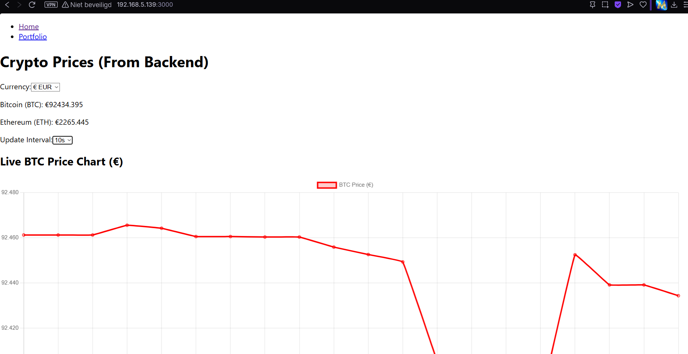
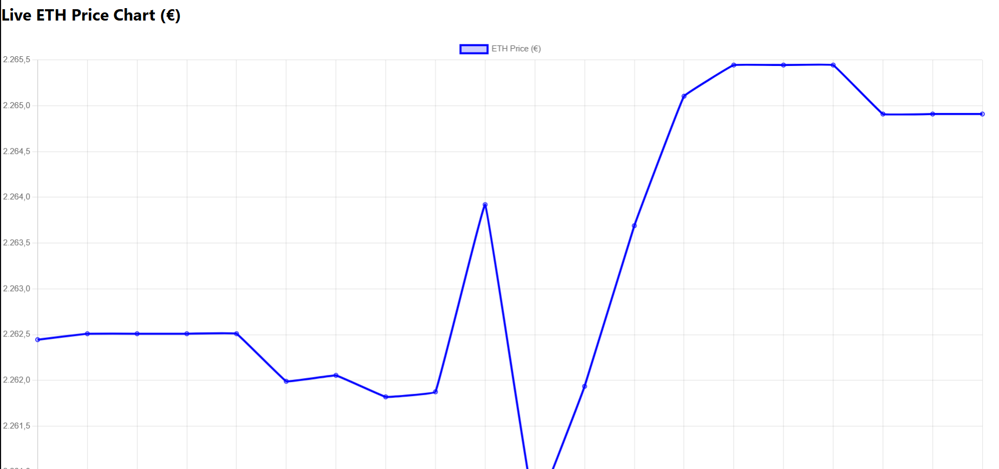
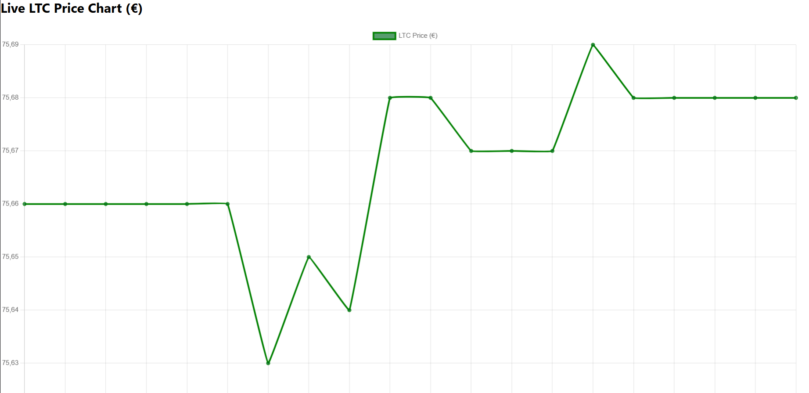
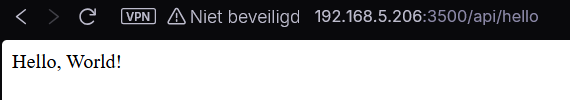
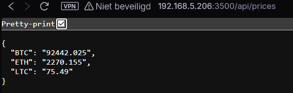

# 📄 **Opdracht – Gebruikershandleiding**

**Naam:** Dewulf Mathis  
**Klas:** 6DATA  
**Datum:** 16/06/2025

---

## Wat doet de applicatie?

De applicatie houdt Live crypto prijzen bij en kan deze verwerken in een grafiek.

Als gebruiker kun je:

- De **munteenheid** aanpassen van **Euro (€)** --> **Amerikaanse Dollar ($)**
- Het **interval** van de grafiek aanpassen **(bv. 1s, 5s, 10s)**

De applicatie slaat de cryptowaarden op in een database (**PostgreSQL**).

## Hoe installeer je de backend en frontend? (Hello World!)

### **reactjs (frontend) in docker**

We maken in de datamap een **react-project** aan.

```bash
# Go to /home/student/ and create folder
cd ~

mkdir ./data/react-docker/
cd ./data/react-docker/

# Create and go to react-project
npx create-react-app react-project
cd ./react-project
```

---

Maak een `Dockerfile` en `.dockerignore` aan in je **react-project**

```bash
cd /home/student/data/react-docker/react-project

touch Dockerfile
touch .dockerignore
```

`Dockerfile:`

```dockerfile
# Use a lightweight Node.js image
FROM node:alpine AS development

# Set working directory inside the container
WORKDIR /react-app

# Copy only package.json and package-lock.json first
COPY package*.json ./

# Install dependencies
RUN npm install

# Copy everything else (your React project)
COPY . .

# Set environment variable for development mode
ENV NODE_ENV development

# Expose the development server port
EXPOSE 3000

# Start the React app
CMD ["npm", "start"]
```

`.dockerignore`

```.dockerignore
node_modules
npm-debug.log
build
.git
*.md
.gitignore
```

Maak een **image** aan met de `Dockerfile` voor de react-app.

```bash
 docker build -f /home/student/data/react-docker/react-project/ -t react-image .  
```

- "**-f**": Path to the docker file
- "**-t**": Name and tag for the image
- "**.**" : Context for the build process.

---

Maak een `docker-compose.yml` aan als dit nog niet is gebeurt **(in ~/data/config/react-docker)** en vul de file in:

```bash
# Create data/config/react-docker/
mkdir ~/data/config/react-docker
cd ~/data/config/react-docker
# Create docker-compose.yml
touch docker-compose.yml
```

`docker-compose.yml`

```yml
services:
  react-docker:
    image: react-image:latest
    build:
      context: /home/student/data/react-docker/react-project
      dockerfile: Dockerfile  # Specify the correct Dockerfile
    ports:
      - "3000:3000"
    volumes:
      - /home/student/data/react-docker/react-project/src:/react-app/src  # Mount only the source code
      - /home/student/data/react-docker/react-project/public:/react-app/public  # Mount public assets
      - /home/student/data/react-docker/react-project/package.json:/react-app/package.json  # Ensure package.json is available
      - /home/student/data/react-docker/react-project/package-lock.json:/react-app/package-lock.json  # Ensure package-lock.json is available
      - /react-app/node_modules  # Prevents overwriting node_modules 
    environment:
      - WATCHPACK_POLLING=true
    networks:
      - proxy
    restart: unless-stopped

networks:
  proxy:
    external: true
```

**Start de react-docker container**

```bash
docker compose -f /home/student/data/config/react-docker/docker-compose.yml up -d
```

---

### **expressjs (backend) in docker**

We maken in de datamap een **express-project** aan.

```bash
# Go to /home/student/ and create folder
cd ~

mkdir ./data/express-docker/
cd ./data/express-docker/

# Create and go to express-project
npx express-generator express-project
cd express-project
npm install  # Install dependencies
```

---

Maak een file `server.js` in je express-project folder:

```bash
cd ~/data/express-docker/express-project
touch server.js
```

`server.js`

```javascript
const express = require("express");
const cors = require("cors");

const app = express();
const PORT = process.env.PORT || 3500;

// Enable CORS for react only
app.use(cors({
  origin: "http://192.168.5.139:3000"
}));

// Root route
app.get("/", (req, res) => {
  res.send("Hello, Docker!");
});

// Define the /api/hello route
app.get("/api/hello", (req, res) => {
  res.json({ message: "Hello, world!" });
});

// Define the /api/test route
app.get("/api/test", (req, res) => {
  res.json({ message: "test!" });
});

// Start the server
app.listen(PORT, () => {
  console.log(`Server running on port ${PORT}`);
});
```

Pas `package.json` aan:

```json
{
  "name": "express-macvlan",
  "version": "1.0.0",
  "description": "Express.js Hello World in Docker with Macvlan",
  "main": "server.js",
  "dependencies": {
    "express": "^4.18.2",
    "cors": "^2.8.5"
  }
}
```
> **Let op:** Vervang `"main"` naar de correcte javascript file in de package.json. (in dit geval server.js)  

---

Maak `Dockerfile` en `.dockerignore` aan **(in express-project)**:

```bash
cd /home/student/data/express-docker/express-project

touch Dockerfile
touch .dockerignore
```

`Dockerfile`

```Dockerfile
# Use official Node.js image
FROM node:18

# Set the working directory   (this is inside the container)
WORKDIR /express-app

# Copy package files first
COPY package.json package-lock.json ./

# Install dependencies
RUN npm install

# Install nodemon globally
RUN npm install -g nodemon

# Copy the rest of the app
COPY . .

# Expose the server port
EXPOSE 3500

# Run Express with nodemon
CMD ["nodemon", "server.js"]
```

`.dockerignore`

```.dockerignore
node_modules
npm-debug.log
Dockerfile
.dockerignore
.git
```

Maak een **image** aan met de `Dockerfile` voor de express-app:

```bash
```bash
 docker build -f /home/student/data/express-docker/express-project/ -t express-macvlan .  
```

- "**-f**": Path to the docker file
- "**-t**": Name and tag for the image
- "**.**" : Context for the build process.

---

Maak een `docker-compose.yml` aan als dit nog niet is gebeurt **(in ~/data/config/express-docker)** en vul de file in:

```bash
# Create data/config/react-docker/
mkdir ~/data/config/express-docker
cd ~/data/config/express-docker

# Create docker-compose.yml
touch docker-compose.yml
# Maak ook een .env file aan
touch .env
```

`docker-compose.yml`

```yml
services:
  express-app:
    image: express-macvlan
    container_name: express-docker-macvlan
    build:
      context: /home/student/data/express-docker/express-project  # Correct path to Dockerfile
    volumes:
      - /home/student/data/express-docker/express-project:/express-app  # Mount the local code directory into the container
      - /express-app/node_modules  # Prevents node_modules from being overwritten
    ports:
      - "3500:3500"  # Expose port 3500 on the container to port 3500 on the host
    environment:
      CHOKIDAR_USEPOLLING: "true"
      DATABASE_NAME: ${DATABASE_NAME}
      DATABASE_USERNAME: ${DATABASE_USERNAME}
      DATABASE_PASSWORD: ${DATABASE_PASSWORD}
      DATABASE_HOST: ${DATABASE_HOST}
      DATABASE_PORT: ${DATABASE_PORT}
    env_file:
      - .env  # Use environment variables from the .env file
    networks:
      vlan5_macvlan:
        ipv4_address: 192.168.5.206  # Static IP on the macvlan network
    restart: unless-stopped
    command: nodemon server.js  # Use nodemon for hot reloading

networks:
  vlan5_macvlan:
    external: true
```

Maak ook een `.env` file aan:

```env
DATABASE_HOST=localhost
DATABASE_PORT=5432
DATABASE_NAME=mydatabase
DATABASE_USERNAME=student
DATABASE_PASSWORD=student
```

**Start de express-docker container**

```bash
docker compose -f /home/student/data/config/express-docker/docker-compose.yml up -d --build
```

---

### **Folderstructuur**

```tree
  data/
  ├── config/
  │   ├── react-docker/
  │   │   └── docker-compose.yml
  │   │
  │   └── express-docker/
  │       ├── .env
  │       └── docker-compose.yml
  │
  ├── react-docker/
  │   └── react-project/
  │
  └── express-docker/
      └── express-project/
```

## Hoe start je de applicatie op?

### Frontend

De frontend is de applicatie zelf draait op een **extern proxy netwerk**.  

- Open je browser
- Typ in de zoekbalk `<ip_server>:3000`
  - In dit geval [192.168.5.139:3000](http://192.168.5.139:3000)

### Backend

De backend haalt de cryptoprijzen af en stuurt ze naar de frontend.  
Je kan deze ook bekijken in je browser.  
De backend draait op een macvlan netwerk en heeft dus een apart IP-adres.

- Open `docker-compose.yml` van express-docker
- Controleer het IP-adres van de express-container
  - In dit geval `192.168.5.206`

- Open je browser
- Typ in de zoekbalk `<ip_macvlan>:3500`
  - In dit geval [192.168.5.206:3500](http://192.168.5.206:3500)

- Navigeer in de zoekbalk naar de juiste API
  - Voor Hello World! (`/api/hello`) [192.168.5.206:3500/api/hello](http://192.168.5.206:3500/api/hello)

## Voor wie is de app bedoeld?

De app is bedoeld voor mensen die (verschillende) cryptomunten **live** willen kunnen **bijhouden**.

Als je intervallen toevoegd zoals *"per dag"* of *"per week"* kan deze applicatie ook gebruikt worden om te **traden**.

## Screenshot van werkende Hello World én realtime prijsweergave

### **Frontend:**





### **Backend:**


